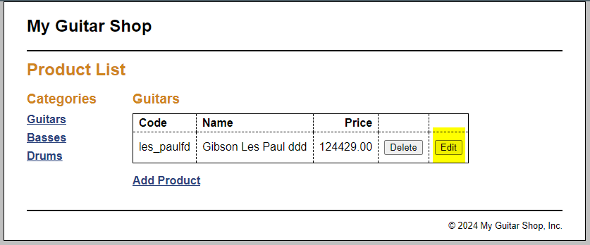
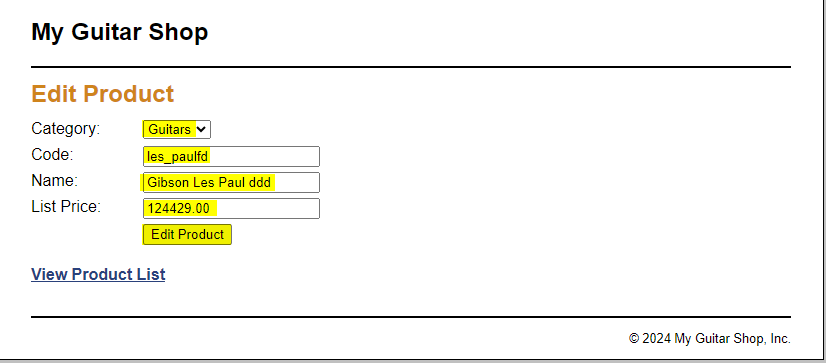
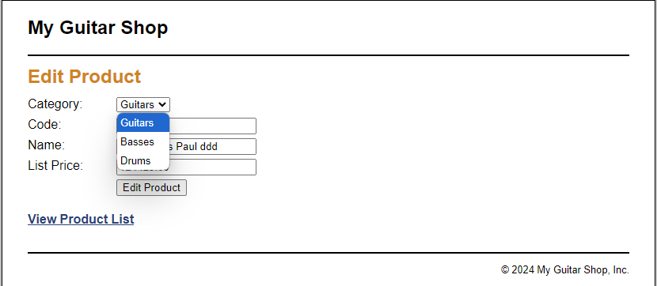
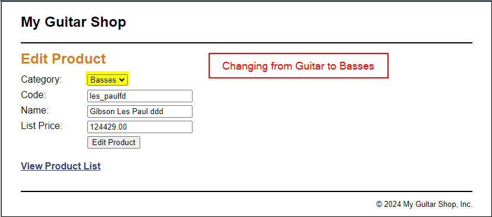
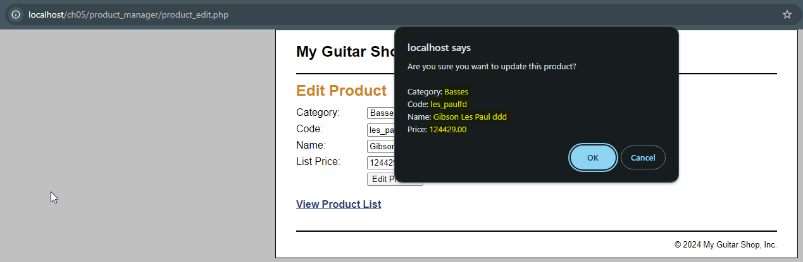
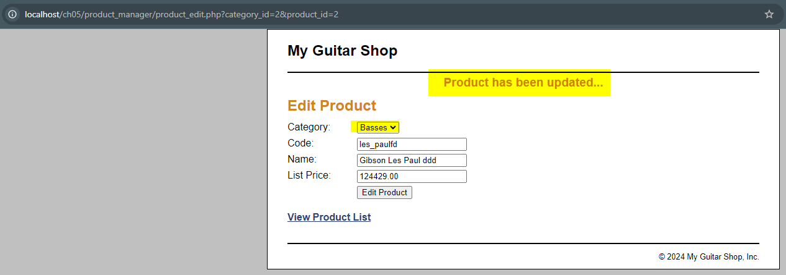
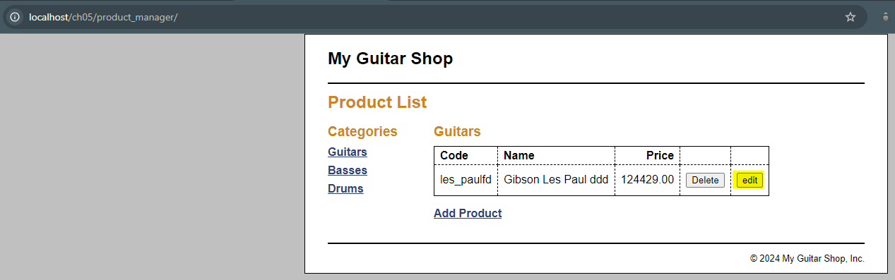
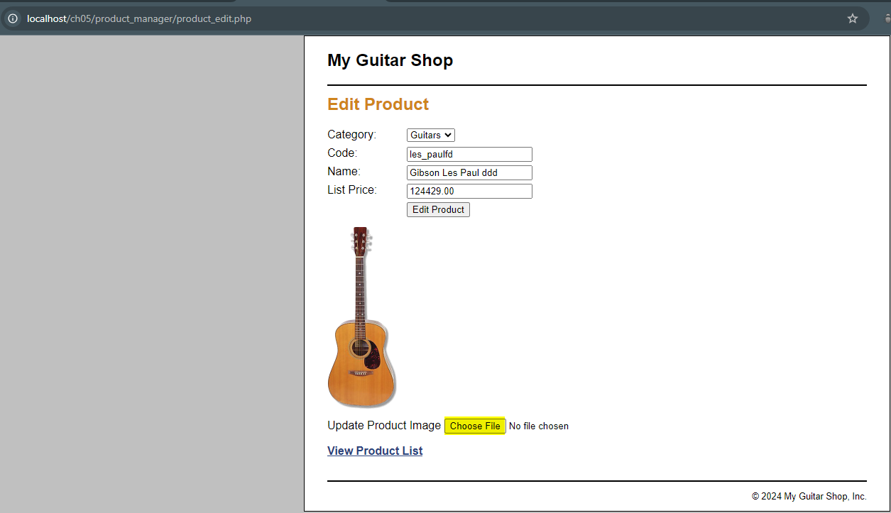
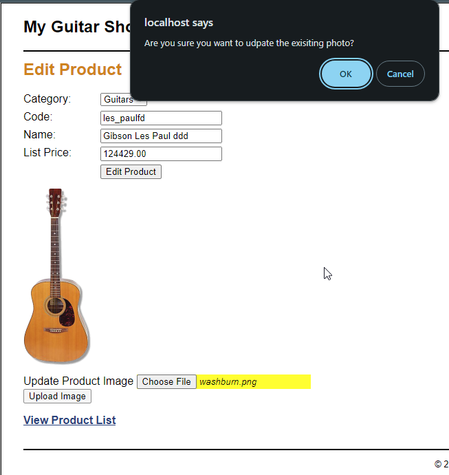
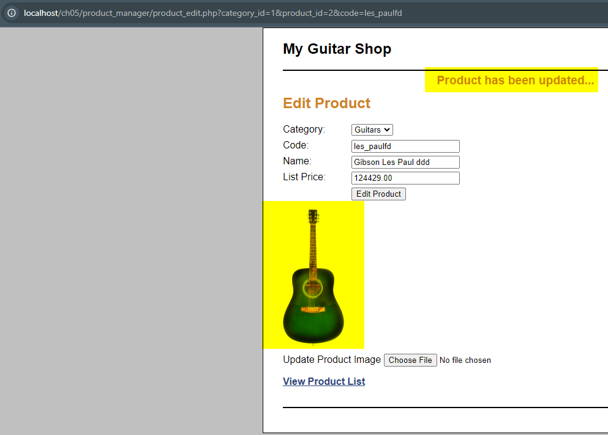

# Assignment 1  

**Name:** Garry Singh  
**Course:** NFO 3135: Advanced Web App Development (S10)  
**Submission Date:** 04 October, 2024  

1. Make sure you have created the database by using the script create_db.sql. Start by fixing an issue in the database. If you take a look at the tables Categories and Products, you will see no referential integrity enforcement between parent and child tables. Fix it with what you know from databases. (22 Marks)

    1) Provide the necessary SQL for enforcing referential integrity between the corresponding foreign key and its parent column. (16 Marks)  
    2) Make sure you cascade modifications and prevent deletions. (6 Marks)  

    Answer-  

   ```sql
   ALTER TABLE products 
   ADD CONSTRAINT FK_products_categories 
   FOREIGN KEY (categoryID) 
   REFERENCES categories(categoryID) 
   ON DELETE CASCADE 
   ON UPDATE CASCADE;  

2. In the Product Manager viewing, the Delete button remove rows from the Products Table. This removal is done without confirmation; hence, accidental deletions are possible. (22 Marks)
    1) Add a confirmation prompt that allows the user to confirm the deletion of the selected product. This requirement is flexible, PHP is not mandatory.  
    Answer- In product_catalog -> product_list.php script added the confirmDeletion() function that prompts the user with a confirmation dialog. If the user clicks "OK", it returns true, allowing the form to submit. If the user clicks "Cancel", it returns false, preventing the submission.  

        `<script>
        function confirmDeletion() {  
            return confirm("Are you sure you   want to delete this product?")
        }  
        </script> <br>`

        And calling the confirmDeletion() function in form's submit attribute to get users confirmation.
        `<form action="." method="post" onclick="return confirmDeletion();">`<br>

    2) Explain the option you chose for fulfilling the requirement and how it is better than other possible solutions.  
    Answer: This can be done using php too but then to redirect users to a confirmation page before proceeding with the deletion whereas in this option we can implement the same functionality by directly handing user interaction on the client side.

3. The manager application allows a user to add and to delete products, but modifying data is not yet possible. You will implement it by following the next recommendations: (46 Marks).

    1) Add a column to the Product List table that contains Edit buttons. (8 Marks)  
    Answer: In product_manager\product_list.php editing the Table of products. Replicating the formatiing for delete product column by leaving the heading of update column empty `<th>&nbsp;</th>`. Then creating the column of udpate buttons:  

        ```<td>
        <form action="." method="post">
            <input type="hidden" name="action" value="update_product">
            <input type="hidden" name="product_id" value="<?php echo $product['productID']; ?>">
            <input type="hidden" name="category_id" value="<?php echo $product['categoryID']; ?>">
            <input type="submit" value="edit">
        </form>
        </td>

      

    2) These buttons should link to an Edit Product page that looks like the Add Product form but this page should already contain the data for the selected product and have an Update Product button below the text boxes of the form. (22 Marks)
      
    

    3) When this button is clicked, the product should be updated. Use a drop-down list to display the correct category name for the product that’s being edited. (10 Marks)
    
    

    4) Add validation snapshots showing the list of products before and after modifying a chosen product.  
    
    

4. The Product Manager application enables maintenance of the products table, but it does not provide a way to update product images. What can you suggest for modifying images associated with products?  
Answer: To allow image updates, we can change the Edit Products page by displaying the current image and adding a form for uploading a new one. I created an upload_image.php script to handle the uploads, using hidden inputs to keep track of the existing image. Once a new image is successfully uploaded, the user is redirected to index.php, which then takes them back to the edit page with the updated image displayed.  



